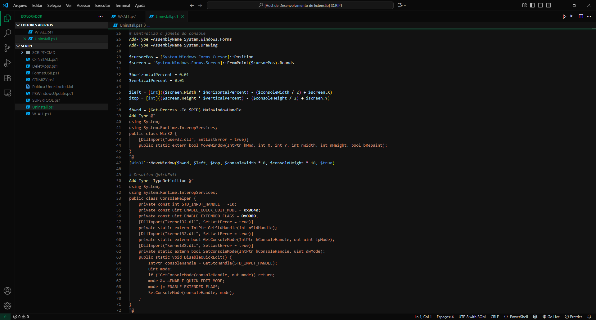

	<H1><B>Ozurac</B></H1>
	
	
UM TEMA ESCURO, TALVEZ VOCÊ GOSTE.

  

  

  

##

<ul>
<li> Tema escuro com alguns detalhes <b>VERDE-ESCURO</b></li>
<li> Comentários com <b>CINZA-ESCURO</b></li>
</ul>

<H4 align="center">Aproveite!</H4>